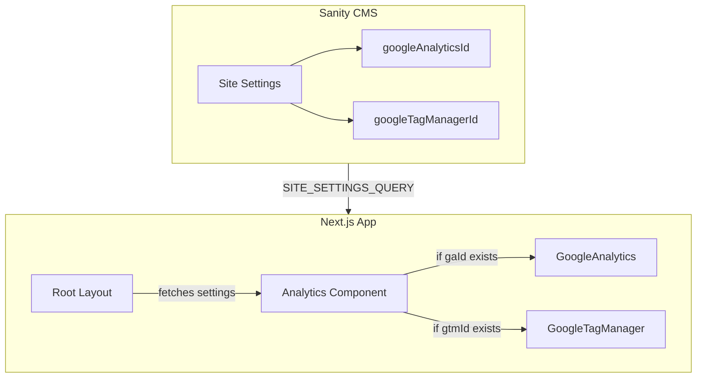

# Google Analytics and GTM Implementation Plan

## Current State

- Sanity schema already has `analytics.googleAnalyticsId` and `analytics.googleTagManagerId` fields in `[siteSettingsType.ts](src/sanity/schemaTypes/singletons/siteSettingsType.ts)`
- The `[SITE_SETTINGS_QUERY](src/sanity/lib/queries.ts)` already fetches these values
- Root layout (`[src/app/layout.tsx](src/app/layout.tsx)`) does not currently use these values
- The `@next/third-parties` package is **not installed**

## Recommended Approach

Use Next.js's official `@next/third-parties/google` package, which provides:

- Optimised loading (scripts load after hydration)
- Automatic pageview tracking for client-side navigations
- Event tracking utilities (`sendGAEvent`, `sendGTMEvent`)
- Better Core Web Vitals compared to manual script injection

## Architecture



## Implementation Steps

### 1. Install `@next/third-parties`

```bash
npm install @next/third-parties@latest
```

### 2. Create Analytics Component

Create a new Server Component at `[src/components/Analytics.tsx](src/components/Analytics.tsx)` that:

- Fetches analytics IDs from Sanity (reusing existing query)
- Conditionally renders `GoogleAnalytics` and/or `GoogleTagManager` components
- Uses `stega: false` to ensure IDs aren't polluted by visual editing

```tsx
import { GoogleAnalytics, GoogleTagManager } from '@next/third-parties/google'
import { sanityFetch } from '@/sanity/lib/live'
import { SITE_SETTINGS_QUERY } from '@/sanity/lib/queries'

export async function Analytics() {
  const { data: settings } = await sanityFetch({
    query: SITE_SETTINGS_QUERY,
    stega: false,
  })

  const gaId = settings?.analytics?.googleAnalyticsId
  const gtmId = settings?.analytics?.googleTagManagerId

  return (
    <>
      {gtmId && <GoogleTagManager gtmId={gtmId} />}
      {gaId && !gtmId && <GoogleAnalytics gaId={gaId} />}
    </>
  )
}
```

**Note:** If GTM is configured, we skip standalone GA because Google recommends configuring GA through GTM when using both.

### 3. Integrate into Root Layout

Update `[src/app/layout.tsx](src/app/layout.tsx)` to include the Analytics component:

```tsx
import { Analytics } from '@/components/Analytics'

export default function RootLayout({ children }) {
  return (
    <html lang='en' suppressHydrationWarning>
      <head>
        <JsonLd />
      </head>
      <Analytics />
      <body>
        <ThemeProvider>{children}</ThemeProvider>
      </body>
    </html>
  )
}
```

## Component Placement

Per Next.js documentation:

- `GoogleTagManager` should be placed directly inside `<html>` (it injects into `<head>`)
- `GoogleAnalytics` should be placed after `<body>` content

## Optional: Event Tracking Utility

For future use, you can track custom events:

```tsx
// In a client component
'use client'
import { sendGAEvent, sendGTMEvent } from '@next/third-parties/google'

// GA4 event
sendGAEvent('event', 'button_click', { value: 'contact_form' })

// GTM event (pushes to dataLayer)
sendGTMEvent({ event: 'form_submit', form_name: 'contact' })
```

## Files to Modify/Create

| File                           | Action                                   |
| ------------------------------ | ---------------------------------------- |
| `package.json`                 | Add `@next/third-parties` dependency     |
| `src/components/Analytics.tsx` | **Create** - Analytics component         |
| `src/app/layout.tsx`           | **Update** - Import and render Analytics |

## Testing

After implementation:

1. Add a GA4 Measurement ID (e.g., `G-XXXXXXXXXX`) in Sanity Studio
2. Use browser DevTools Network tab to verify `gtag.js` loads
3. Check GA4 Realtime reports to confirm pageviews are tracked
4. Test client-side navigation to verify SPA pageview tracking works
